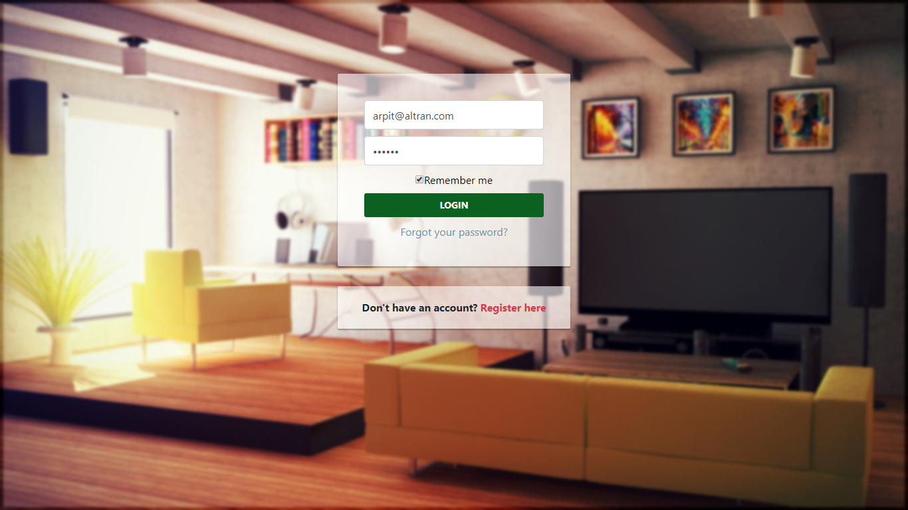

<h1 align="center">
  Online Furniture Store
</h1>

## Prerequisites
1) Java 1.8 or later
2) Eclipse
3) Maven
4) TomCat Server 7.0
4) MySQL Workbench 5 or later

## Installation
1) Import the project in Eclipse
2) Right Click on the Project Folder
3) Maven -> Update Project
4) Run As -> Maven Install
4) Run As -> Run on Server -> TomCat 7.0

## Setting Up Database
1) Open MySQL Workbench
2) Open Localhost Server Instance
3) File -> Open SQL Script
4) Open the shop.sql file in Project Folder
5) Execute the script

## Screenshots

<h4 align="center">HomePage</h4>

<h4 align="center">Advance Filter</h4>

<h4 align="center">Login Page</h4>

<h4 align="center">Alerts / Notificatons</h4>

<h4 align="center">View Cart Page</h4>

<h4 align="center">Change Password Page</h4>

